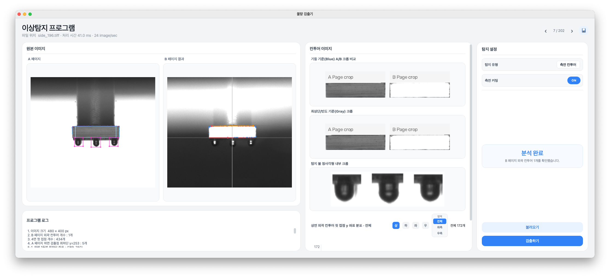

# Semiconductor Die Surface Inspection System

[English](README.md) | [한국어](README_KO.md)

> An OpenCV-based program designed to rapidly detect defects on the top, bottom, left, and right surfaces of semiconductor dies.



## Background

This project combines rule-based computer vision with AI instead of relying exclusively on an object-detection AI model throughout the inspection process. The goal is to reduce the computational burden of high-resolution image processing while improving inspection speed, accuracy, decision traceability, and maintainability. This approach also aligns with human-in-the-loop, high-speed inspection and precision-review, and layered rule–AI workflows publicly presented by semiconductor manufacturers and inspection-equipment providers.

## Current Features

#### Side Inspection

Side inspection checks the die surface and shoulder balls (shoulder bumps) for damage. The process first converts the B page to grayscale, applies thresholding, and extracts the surface contour.

1. Surface inspection
   - Measures the first contact points from the top, bottom, left, and right edges.
   - Selects the top and bottom cutting lines from the contact-point frequency and density distribution, helping compensate for slight rotation or uneven contour geometry.
   - Calculates a separate pillar-based reference from the A page and applies both reference methods to identical coordinates on the A/B pages for crop comparison.

2. Shoulder-ball inspection
   - Scans downward from each x-coordinate of the bottom contour on the A page and detects the first white pixel as a side-ball candidate.
   - The bottom contour range is divided into three sections, and the lowest point in each section is evaluated to select valid ball positions.
   - Detected positions are displayed as square crop regions. A sample is classified as detected only when both a valid surface contour and valid ball positions are found.
   - The **원호 비교** (arc comparison) toggle beside the ball preview switches between the original crop (off) and lower-arc analysis (on), cached per image.
   - Analysis applies mild unsharp masking and inverse Otsu thresholding to the same A-page crop, selects the lower central dark component, and scans upward in each column. A circle with radius **10–20 original pixels** is fitted to the lower outline within 20 px of its tip, excluding the upper surface band.
   - R is radius, E is radial RMSE, and S is the mean mirrored lower-profile height difference, all in original pixels. Cyan dots show measured points; the circle/cross show the fit. Experimental review limits are E > 1.5 px, S > 2 px, angular support < 70°, or column continuity < 90%; crop clipping, radius-limit hits and points above the lower arc also trigger review. Insufficient points/curvature remain unmeasurable.
   - These are experimental measurements, not `4πA/P²` circularity or final OK/NG classification. The main detection status retains the existing position criteria. Upper attachments are not evaluated, and limits need validation against labeled samples.

#### Bottom Inspection · Chip Location and Circle Candidates

- Only `Bottom Detection` processes page A for this flow. Page B is an original reference.
- A 3×3 Gaussian blur and threshold `max(background + 20, (background + Otsu) / 2)` separate the chip, including its gray substrate.
- Six 40×40 px ROIs follow the chip position and rotation: 10%/90% across its width and 10%/50%/90% down its height.
- Dark components are extracted from the binary image before closing or filling its interior. External background and components smaller than 10 px² are excluded.
- Circle candidate conditions: **contour area 300–450 px², circularity ≥ 0.70, short/long side ratio ≥ 0.70, and distance from the expected ROI center ≤ 12 px**. Circularity is `4π × area / perimeter²`.
- Rejected components retain their actual contours and review reasons; empty ROIs remain missing. Components touching the search boundary and multiple qualifying components also require review.
- A shows the ROIs and actual contours: green for candidates, orange for review, red for missing. Detail captions use C for circularity and A for area. The chip outline rectangle and silhouette panel stay hidden.
- The status distinguishes six candidate regions from results requiring review. **Candidate acceptance is not a product pass/fail classification.**
- The detector assumes one rectangular chip on a dark background and rejects clipped, small, or elongated chips. Original A pixels and the original crop remain unchanged.

#### Top Surface Inspection

_Planned for a future release._

## Project Structure

```text
├── app.py             # Starts the PyQt5 application
├── ui.py              # Main window layout, state, and user interaction
├── ui_components.py   # Reusable image, histogram, and modal widgets
├── general.py         # Shared image I/O, capture-path, and notes helpers
├── contour.py         # Detection-independent contour extraction and geometry
├── bottom/
│   ├── pipeline.py    # A thresholding, chip location, and circle pipeline
│   └── circles.py     # Six ROIs, dark components, candidate rules, and previews
├── side/
│   ├── pipeline.py    # Orchestrates the complete Side detection flow
│   ├── surface.py     # Side surface detection and crop previews
│   └── ball.py        # Side ball detection
├── styles.py          # UI styles
├── requirements.txt   # Python dependencies
├── assets/            # Application icons and other resources
└── dataset/           # Inspection image data
```

Verify chip localization, circle candidates, and mode switching with `python -m unittest discover -s tests -v`.

## Requirements

- Python 3.10–3.12 recommended
- Input `TIFF` images must contain identically sized A/B pages. The program assumes a specific dataset format.

## Installation

Run the following commands after receiving the project.

### macOS / Linux

```bash
cd diehand_cv
python3 -m venv .venv
source .venv/bin/activate
python -m pip install --upgrade pip
python -m pip install -r requirements.txt
```

### Windows PowerShell

```powershell
cd diehand_cv
py -m venv .venv
.\.venv\Scripts\Activate.ps1
python -m pip install --upgrade pip
python -m pip install -r requirements.txt
```

## Run

```bash
python app.py
```

> This repository was developed for specific experimental research and may not be suitable for other projects.
