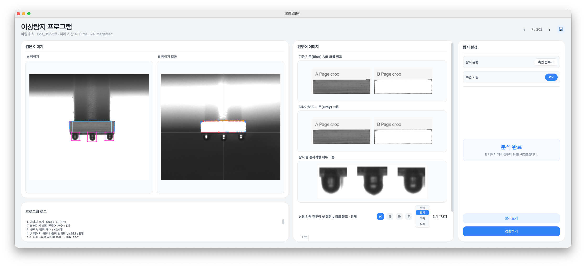
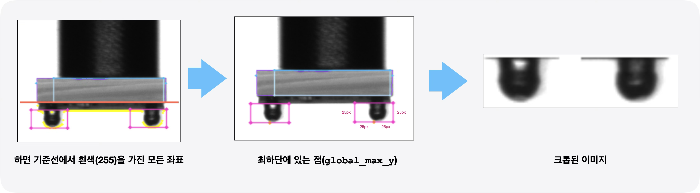

# 반도체 칩 표면 검사 프로그램

[English](README.md) | [한국어](README_KO.md)

> 반도체 칩(Die)의 상면, 하면, 좌측면 및 우측면 결함을 빠르게 검출하기 위한 OpenCV 기반 프로그램입니다.



## 배경
본 레포지토리 연구는 객체 검출 AI 모델을 전체 검사 과정에 단독으로 적용하지 않고, Rule-Based Computer Vision과 AI를 결합한 구조를 적용하고 합니다. 이를 통해 고해상도 영상 처리에 따른 컴퓨팅의 부담을 줄이고, 검사 속도와 정확도 뿐만 아니라 판정 근거의 추적성과 유지보수성을 함께 확보할 수 있습니다. 이러한 접근은 최근 반도체 제조사 및 검사 장비 업체가 공개한 Human-in-the-loop, 고속 검사-정밀 Review, Rule-AI 계층화 사례와도 일치합니다. 

## 현재 기능

#### 측면 검사

측면 검사는 칩의 표면과 숄더 볼(숄더 범프)의  손상 여부를 확인 합니다.
먼저, B 페이지를 그레이스케일로 변환하고 임계값을 적용해 표면 컨투어를 추출합니다.

1. 표면 검사
   - 상·하·좌·우 가장자리에서 처음 닿는 접점을 측정합니다.
   - 접점의 빈도와 밀집도 분포를 바탕으로 상·하면 커팅 기준선을 선택하여 측면의 미세한 회전이나 불균일한 컨투어 형상을 보정합니다.
   - A 페이지에서 별도의 기둥 기준을 계산하고, 두 기준 방식을 A/B 페이지의 동일한 좌표에 적용해 크롭 결과를 비교합니다.

2. 숄더 볼 검사

   2-1. `find_downward_contour_white_points`
      - B 페이지에서 얻은 표면 하면 좌표를 시작점으로 아래방향으로 증가시켜 흰색(255)을 가진 위치들을 모두 탐색하여 수집한다.
      - 이떄, 표면 하면 기준선 보다 5px 이상 아래에 위치한 지점(`SCAN_START_OFFSET=5`)만 수집한다. (하면 아래 손상이나 빛비침 여부로 인해 흰색이 된 지점 배제하기 위함)

   2-2. `get_distant_bottommost_points`
      - 흰색 픽셀들 중에서 전체 최하단에 있는 점(`global_max_y`)을 구한다.(볼 가장 하단)
      - 조건으로, y축으로 10px, x축으로 40px 떨어진 지점에서 새로운 하단점을 선정

   2-3. `get_ball_square_bounds`, `draw_ball_squares`
      - 선정된 볼 최하단점을 기준으로 바운딩 박스를 그려 UI에 전달

   > 옵션) 원호 정밀 측정 및 윤곽 검증(`ball_arc.measure_ball_arcs`)
      > - Canny 엣지 추출, 피팅 수행하여 반경, 오차, 윤곽선, 대칭성을 계산



#### 하면 검사 · 칩 위치와 원 후보

1. 이진화 작업 및 칩 위치 찾기
   1-1. `find_bottom_chip`, `_binarize`, `_locate_bottom_chip`
      - 배경의 밝기와 Otsu 값을 이용해 회색 기판만 남기는 이진화 작업을 수행한다. 
      - 칩의 위치 및 회전각을 추정한다.
   1-2. `find_circle_regions`
      - 칩 내부의 단위 벡터로 실제 변의 길이를 파악헌다.
      - 칩의 4개 모서리(`chip.corners`)를 기준으로 6개 검사 영역(ROI)`corners`을 설정한다.
      - 각 ROI 내에서 검은색 성분(칩 표면)을 검출한다.
   1-3. `draw_circle_regions`, `create_circle_roi_preview`
      - 원 후보들의 윤곽선 그리기
      - 원들만 있는 ROI 타일 붙이고 성적 적기

#### 상면 표면 검사

_추후 지원 예정_

## 프로젝트 구조

```text
├── app.py             # PyQt5 애플리케이션 실행
├── ui.py              # 메인 화면 레이아웃, 상태 및 사용자 상호작용
├── ui_components.py   # 이미지, 히스토그램 및 모달 공용 위젯
├── general.py         # 이미지 입출력, 캡처 경로 및 메모 공통 기능
├── contour.py         # 검출 방식에 독립적인 컨투어 추출과 기하 계산
├── bottom/
│   ├── pipeline.py    # A 기반 이진화·칩 위치·원 후보 흐름
│   └── circles.py     # 6개 ROI·검은 성분·원 후보 조건과 표시
├── side/
│   ├── pipeline.py    # 전체 Side 검출 흐름 조립
│   ├── surface.py     # 측면 표면 검출 및 크롭 미리보기
│   └── ball.py        # 측면 볼 검출
├── styles.py          # UI 스타일
├── requirements.txt   # Python 의존성
├── assets/            # 애플리케이션 아이콘 및 기타 리소스
└── dataset/           # 검사 이미지 데이터
```

칩 위치·원 후보·모드 전환 검증: `python -m unittest discover -s tests -v`

## 요구 사항

- Python 3.10–3.12 권장
- 입력 `TIFF` 이미지는 크기가 동일한 A/B 페이지를 포함해야 합니다. 특정 데이터셋 형식을 전제로 합니다.

## 설치

프로젝트를 받은 후 다음 명령을 실행합니다.

### MacOS / Linux

```bash
cd diehand_cv
python3 -m venv .venv
source .venv/bin/activate
python -m pip install --upgrade pip
python -m pip install -r requirements.txt
```

### Windows PowerShell

```powershell
cd diehand_cv
py -m venv .venv
.\.venv\Scripts\Activate.ps1
python -m pip install --upgrade pip
python -m pip install -r requirements.txt
```

## 실행

```bash
python app.py
```

> 이 저장소는 특정 실험 연구를 위해 제작된 프로그램이므로 다른 프로젝트에는 적합하지 않을 수 있습니다.
